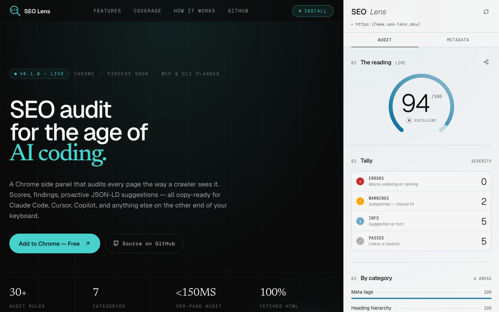

# SEO Lens

Browser extension that audits SEO metadata on any webpage. Instant, actionable feedback on title, meta tags, headings, structured data, and more — with every finding copyable as structured plain text for AI coding agents (Claude Code, Cursor, Copilot).



## Features

- **Live audit pipeline** driven by the active tab. Re-runs on tab switch, window focus, full load, SPA soft-nav, or manual refresh.
- **Crawler-accurate fetch.** Background service worker fetches the active tab's URL and parses with `DOMParser`, matching what a crawler sees (not the rendered SPA DOM).
- **Rules coverage.** Title, meta description, headings (single H1, skip-level), image alt, structured data (schema.org recognition, rich-results validation, recommendations), social OG/Twitter, canonical, robots directives.
- **Side panel UI** with two tabs:
  - *Audit* — overall score, severity counts, per-category scores, filterable findings list with per-finding copy (grep-able snippets), share-as-image card, Markdown/JSON export.
  - *Metadata* — meta, social preview, heading tree, JSON-LD blocks, breadcrumbs, indexing dashboard, site-level signals, image gallery.
- **Copy-for-AI.** Per-finding copy, per-section copy in Metadata, full-report exports.

## Monorepo

```
apps/
  extension/    Chrome extension (WXT + React, shipped)
  web/          Landing page (Next.js, scaffolded)
packages/
  seo-rules/    Audit engine — rules, schemas, view-model derivations (Effect-TS, runtime-agnostic)
  ui/           Shared shadcn/ui components
  api/          API package
  env/          Environment config
  typescript-config/
```

`seo-rules` is runtime-agnostic so it can power non-extension surfaces (CLI, MCP server, desktop) later.

## Stack

- TypeScript, Bun, Turborepo
- Effect-TS (rules engine, schemas, streams)
- WXT + React 19 (extension)
- Tailwind v4, shadcn/ui
- Vitest, Biome / Ultracite

## Development

```bash
bun install
bun run dev           # all apps via turbo
bun run test          # NOT `bun test` — use `bun run test`
bun run typecheck
bun run lint
```

Extension-only:

```bash
cd apps/extension
bun run dev           # launches WXT dev build
bun run build
bun run zip           # packaged .zip for Chrome Web Store
```

Load the unpacked dev build from `apps/extension/.output/chrome-mv3` in `chrome://extensions`.

## Roadmap

1. Manual full-site audit — user-triggered sampled crawl with URL-pattern grouping, copyable site-wide report.
2. Additional interfaces — CLI, MCP server, desktop app sharing the same core.

Phase 2 targets Firefox; Edge and Safari later.

## Documentation

- [docs/plan/context.md](./docs/plan/context.md) — project context
- [docs/plan/plan.md](./docs/plan/plan.md) — roadmap
- [docs/plan/plan-extension.md](./docs/plan/plan-extension.md) — shipped extension plan
- [docs/plan/user-stories.md](./docs/plan/user-stories.md)
- [docs/plan/json-ld-improvements.md](./docs/plan/json-ld-improvements.md)

